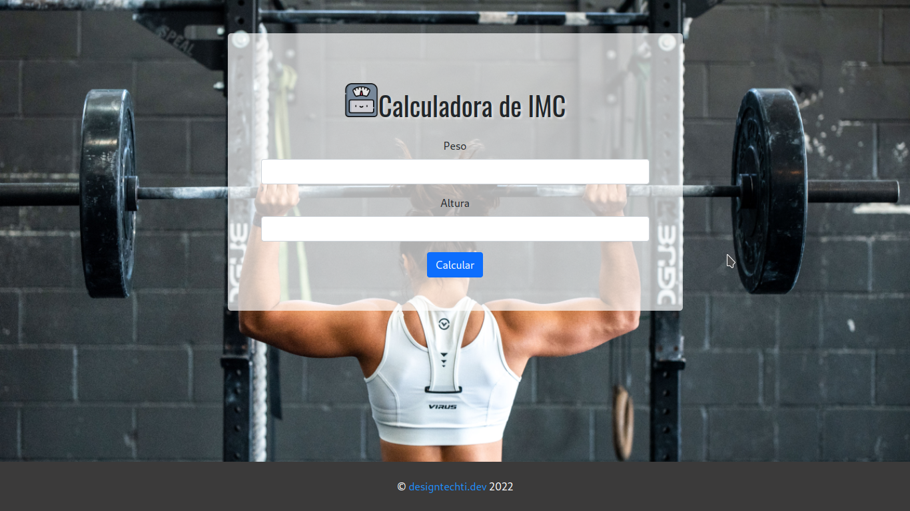

# Calculadora IMC

1. Exibir uma mensagem correspondente à classificação do IMC fornecido.

```js
// Fórmula
let peso = prompt("Digite o seu peso: "); // em kg
let altura = prompt("Digite a sua altura: "); // em metros
let imc = let peso / altura ** 2;
```

>**Dica:** utilizar "." para representar frações

Tabela de interpretação do IMC

| IMC                | Classificação    | Grau de Obesidade |
| ------------------ | ---------------- | ----------------- |
| Menor 18.5         | Magreza          | 0                 |
| Entre 18.5 & 24.99 | Normal           | 0                 |
| Entre 25.0 & 29.99 | Sobrepeso        | I                 |
| Entre 30.0 & 39.99 | Obesidade        | II                |
| Maior que 40       | Obesdade Mórbida | III               |
